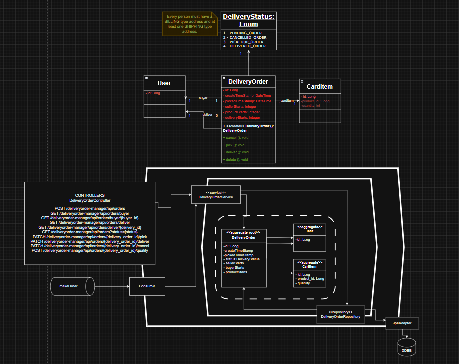

# DeliveryOrder Manager - API

Este microservicio forma parte de una arquitectura basada en microservicios y tiene como responsabilidad la gestión de órdenes de entrega. Expone una API REST segura, con autenticación mediante JWT y control de acceso basado en roles (ADMIN, BUYER, DELIVERY). La documentación de la API se encuentra integrada mediante Swagger.

---

## Funcionalidades

### Creación de órdenes

- `POST /deliveryorder-manager/api/orders`  
  Permite crear una nueva orden de entrega. Aunque en su mayoría se crean con la cola de RabbitMQ, también se puede utilizar este endpoint manualmente en casos específicos.  
  **Rol requerido:** ADMIN

**Ejemplo de solicitud (JSON):**

```json
{
  "productId": 15,
  "quantity": 2,
  "buyerId": 8,
  "deliveryId": null,
  "cardItemId": 34,
  "priceTotal": 9000.0,
  "productName": "Auriculares inalámbricos"
}
```


### Gestión de órdenes por comprador

- `GET /deliveryorder-manager/api/orders/buyer`  
  Recupera las órdenes del comprador autenticado.  
  **Roles permitidos:** BUYER, ADMIN

- `GET /deliveryorder-manager/api/orders/buyer/{buyer_id}`  
  Recupera las órdenes de cualquier comprador.  
  **Rol requerido:** ADMIN

### Gestión de órdenes por repartidor

- `GET /deliveryorder-manager/api/orders/deliver`  
  Recupera las órdenes asignadas al repartidor autenticado.  
  **Roles permitidos:** DELIVERY, ADMIN

- `GET /deliveryorder-manager/api/orders/deliver/{deliver_id}`  
  Recupera las órdenes de cualquier repartidor.  
  **Rol requerido:** ADMIN

### Consultas por estado

- `GET /deliveryorder-manager/api/orders?status={estado}`  
  Devuelve las órdenes filtradas por estado (por ejemplo, PENDING, ASSIGNED, DELIVERED).  
  **Requiere autenticación**

### Asignación y gestión de entrega

- `PATCH /deliveryorder-manager/api/orders/{delivery_order_id}/pick`  
  Permite a un repartidor tomar una orden para su entrega.  
  **Roles permitidos:** DELIVERY, ADMIN

- `PATCH /deliveryorder-manager/api/orders/{delivery_order_id}/deliver`  
  Marca una orden como entregada.  
  **Roles permitidos:** DELIVERY, ADMIN

- `PATCH /deliveryorder-manager/api/orders/{delivery_order_id}/cancel`  
  Permite cancelar una orden de entrega.  
  **Roles permitidos:** DELIVERY, ADMIN

### Calificación de la orden

- `POST /deliveryorder-manager/api/orders/{delivery_order_id}/qualify`  
  Registra la calificación del producto, vendedor y repartidor.  
  **Roles permitidos:** BUYER, ADMIN

**Ejemplo de solicitud (JSON):**

```json
{
  "productStarts": 4,
  "sellerStarts": 5,
  "deliveryStarts": 5
}
```

---

---

## Diagrama hexagonal



---

## Seguridad y Autenticación

### JWT

El microservicio valida tokens JWT en todas las solicitudes protegidas, mediante un filtro de autorización personalizado (`JwtAuthorizationFilter`), con control de roles y permisos especificados en la configuración de seguridad (`SecurityConfig`).

### Roles y accesos

A continuación se detalla la matriz de accesos:

| Endpoint                                                | BUYER | DELIVERY | ADMIN |
|---------------------------------------------------------|:-----:|:--------:|:-----:|
| `POST /orders`                                          | No    | No       | Sí    |
| `GET /orders/buyer`                                     | Sí    | No       | Sí    |
| `GET /orders/buyer/{buyer_id}`                          | No    | No       | Sí    |
| `GET /orders/deliver`                                   | No    | Sí       | Sí    |
| `GET /orders/deliver/{deliver_id}`                      | No    | No       | Sí    |
| `GET /orders?status=...`                                | Sí    | Sí       | Sí    |
| `PATCH /orders/{id}/pick`                               | No    | Sí       | Sí    |
| `PATCH /orders/{id}/deliver`                            | No    | Sí       | Sí    |
| `PATCH /orders/{id}/cancel`                             | No    | Sí       | Sí    |
| `POST /orders/{id}/qualify`                             | Sí    | No       | Sí    |

### Endpoints públicos

Los siguientes recursos están disponibles sin autenticación:

- /manage/health
- /swagger-ui/**
- /v3/api-docs/**
- /swagger-resources/**
- /webjars/**


---

## Tecnologías

- Java 17  
- Spring Boot  
- Spring Security con JWT  
- Spring Data JPA  
- Lombok  
- Maven  
- Docker  
- Swagger / OpenAPI  

---

## Documentación

La documentación de la API puede consultarse mediante Swagger en la siguiente URL, con el servicio en ejecución:

[http://localhost:8084/swagger-ui/index.html#/](http://localhost:8084/swagger-ui/index.html#/)

---

## Ejecución

El microservicio se puede desplegar utilizando Docker en forma independiente, o a través de un `docker-compose` con el resto de los servicios del ecosistema.  

Ejemplo de ejecución básica:

```bash
docker build -t deliveryorder-manager .
docker run -p 8084:8084 deliveryorder-manager

